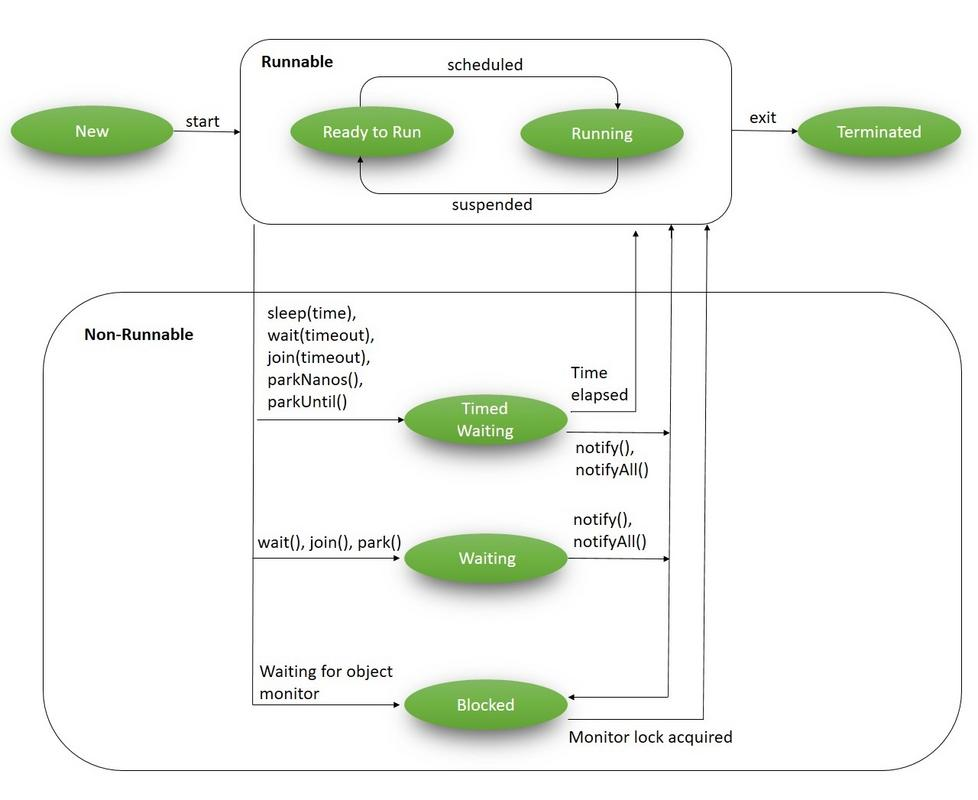

# Threads in Java
Threads are small process which run in shared memory space within a process. 

### Application/Main thread
The thread which is responsible for starting the application by invoking the main method is called Application thread.

## Thread Definition
- Thread is an independent path of code execution.
- Threads can be used to perform time-intensive tasks.
- Once a thread is created, it executes code sequences that are encapsulated in objects that are knows as runnables.
- Threads can initiate an asynchronous task.
- The JVM gives each thread its own private JVM stack, which is basically its own private area of memory.
    - If two threads execute the same method each will have its own copy of the stack to store the method local variables.
    - The stack holds local variables and partial results(data).
    - It also tracks next instructions to be executed and plays a part in calling methods and handling return values.

### Deamon Thread
- When a thread is created it is either deamon or non-deamon thread. 
- A deamon thread is a thread that does not prevent the JVM from exiting when the program finishes but the thread is still running.
- By default the thread is created as non-deamon threads.
- An example of a deamon thread might be the java garbage collection, which runs even after the program finishes.
- To create a deamon thread call setDeamon(true)
- The Java main method is a non-deamon thread, so the JVM continues to execute threads; including main, until either the exit method of the class runtime has been called, or all the threads from this particular program that are not labelled as deamon threads have died.

### Life cycle of a Thread
Ref: https://www.baeldung.com/java-thread-lifecycle

### Difference between sleep()(Static method) and wait()(Called on object)
    - sleep is based on time
    - wait is over when thread is notified.

### Implementing threads
- Extend Thread class or
- Implement Runnable interface.

#### Difference between Runnable and Callable
The Callable interface is similar to Runnable, in that both are designed for classes whose instances are potentially executed by another thread. A Runnable, however, does not return a result and cannot throw a checked exception.

### Multithreaded
Multithreading means a single program having different threads executing independently at the same time. Multiple threads execute instructions according to the program code in a process or a program. Multithreading works the similar way as multiple processes run on one computer. Threads are obtained from the pool of available ready to run threads and they run on the system CPUs.

### Inter thread communication
When we need one thread to communicate with other threads in a process.
- wait()
- notify()
- notifyAll()

### Yield method
Temporarily pause and allow other threads of same priority to execute.
https://www.geeksforgeeks.org/java-concurrency-yield-sleep-and-join-methods/

### Scheduling threads
Executing multiple threads on a single CPU, in some order, is called scheduling. The chosen thread will run until one of the following conditions is true.
- A higher priority thread becomes “Runnable”
- It yields or it run method exits

### Synchronization
Synchronizing threads means access to shared data or method execution logic in a multithreaded application is controlled in such a way that only one thread can access the method /shared data at a time. The other threads will wait till the thread releases the control. The shared data is considered to be thread safe.
- Ways to synchronize
    - Synchronized blocks
    - Synchronized methods

### Deadlock
Deadlock describes a situation where two or more threads are blocked forever, waiting for each other. Here's an example.
Alphonse and Gaston are friends, and great believers in courtesy. A strict rule of courtesy is that when you bow to a friend, you must remain bowed until your friend has a chance to return the bow. Unfortunately, this rule does not account for the possibility that two friends might bow to each other at the same time. Deadlock.java class models this possibility.
When Deadlock runs, it's extremely likely that both threads will block when they attempt to invoke bowBack. Neither block will ever end, because each thread is waiting for the other to exit bow.

### Executors
The Concurrency API introduces the concept of an ExecutorService as a higher level replacement for working with threads directly. Executors are capable of running asynchronous tasks and typically manage a pool of threads, so we don't have to create new threads manually. All threads of the internal pool will be reused under the hood for revenant tasks, so we can run as many concurrent tasks as we want throughout the life-cycle of our application with a single executor service.
More info - https://winterbe.com/posts/2015/04/07/java8-concurrency-tutorial-thread-executor-examples/

### Difference between a thread and process?
Both processes and threads are independent sequences of execution. 
The typical difference is that threads (of the same process) run in a shared memory space, while processes run in separate memory spaces.
A thread is an entity within a process that can be scheduled for execution.

https://www.quora.com/What-is-the-difference-between-a-process-and-a-thread

### Disadvantages of threads

- Global variables are shared between threads. Inadvertent modification of shared variables can be disastrous.

- Many library functions are not thread safe.

- If one thread crashes the whole application crashes.

- Memory crash in one thread kills other threads sharing the same memory, unlike processes.

- There is a lack of coordination between threads and operating system kernel. Therefore, process as whole gets one time slice irrespective of whether process has one thread or 1000 threads within. It is up to each thread to relinquish control to other threads.

- User-level threads requires non-blocking systems call i.e., a multi threaded kernel. Otherwise, the entire process will have blocked in the kernel, even if there are runnable threads left in the processes. For example, if one thread causes a page fault, the process blocks.

- Threads are totally dependent on Operating Systems. 

### Exchanging data between threads in Java

https://www.youtube.com/watch?v=AAdhNxaAY7I

### Synchronizers
- Latches
- Barriers
- Semaphores
- Exchangers

### Processing a large list faster (ProcessListFaster)
`ProcessListFaster` shows how to speed up processing of a large collection by splitting the work
across multiple threads instead of iterating over everything on a single thread.

The idea is *data parallelism*: the same operation is applied independently to different parts of
the data, so the parts can be processed at the same time.

**Flow**
1. **Build items** – create a large list (100,000 items) to process.
2. **Partition** – split the list into contiguous chunks, one per thread, using `List.subList()`.
   Each chunk is wrapped in a `Worker`. The last chunk absorbs any remainder so nothing is dropped
   when the size does not divide evenly.
3. **Run in parallel** – submit all workers to a fixed-size thread pool
   (`Executors.newFixedThreadPool`) via `ExecutorService.invokeAll()`, which submits every task and
   blocks until all of them complete.
4. **Wait & propagate errors** – call `Future.get()` on each returned future. If a worker threw an
   exception, `get()` re-throws it wrapped in an `ExecutionException`, so failures are not silently
   lost.
5. **Shut down** – the executor is always shut down in a `finally` block to release its threads.

**Key APIs**
- `Callable<V>` vs `Runnable` – `Worker` implements `Callable<Void>` so it can return a value and
  throw checked exceptions (unlike `Runnable`).
- `ExecutorService.invokeAll(tasks)` – submits a batch of tasks and waits for all to finish,
  returning a `List<Future>` in the same order as the tasks.
- `Future.get()` – blocks for the result and surfaces any exception thrown inside the task.

**Notes / trade-offs**
- `subList()` returns a *view* backed by the original list; the original list must not be
  structurally modified while the workers run.
- Benefit comes from CPU-bound work being spread across cores. In this demo the work is
  `System.out.println`, which is I/O bound and serialized by the console lock, so the parallel
  version is mainly illustrative of the pattern rather than a guaranteed speed-up.
- Choose the thread count based on the workload: roughly the number of CPU cores for CPU-bound work,
  and potentially higher for I/O-bound work.

### Virtual threads (VirtualThreadsExample)
Virtual threads were stabilised in **Java 21** ([JEP 444](https://openjdk.org/jeps/444)) and change
how you think about scaling concurrent work.

- A **platform thread** is a thin wrapper over an OS thread. It is expensive (megabytes of stack,
  OS scheduling), so historically we pooled a small number of them (see `ExecutorExample`,
  `ProcessListFaster`).
- A **virtual thread** is scheduled by the JVM onto a small pool of platform "carrier" threads.
  It is so cheap you can create millions of them. When a virtual thread blocks (sleep, I/O, lock),
  it is *unmounted* from its carrier, freeing that carrier to run other virtual threads.

**Why it matters:** the simple, readable "one thread per task" model now scales to hundreds of
thousands of concurrent tasks. You no longer need to pool threads or write callback-heavy async code
just to handle many blocking operations.

**Creating them**
- `Thread.ofVirtual().start(runnable)` – start a single virtual thread.
- `Executors.newVirtualThreadPerTaskExecutor()` – an executor that spawns a fresh virtual thread per
  task; closing it (try-with-resources) waits for all tasks to finish.

**When to use**
- Great for **I/O-bound** workloads (many blocking calls) — that's where the scalability win comes
  from.
- Not a speed-up for **CPU-bound** work; you are still limited by the number of cores.
- Avoid pooling virtual threads (they are cheap — just create one per task), and prefer them over
  `synchronized` around blocking calls to avoid pinning a carrier thread.
